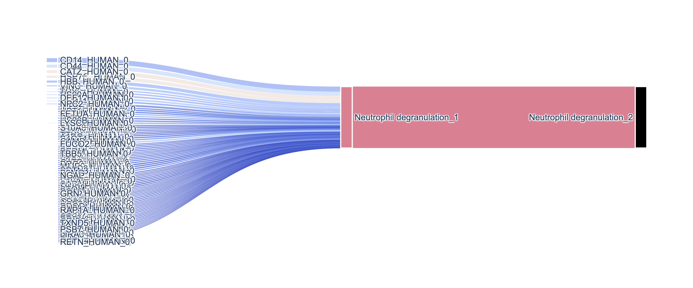
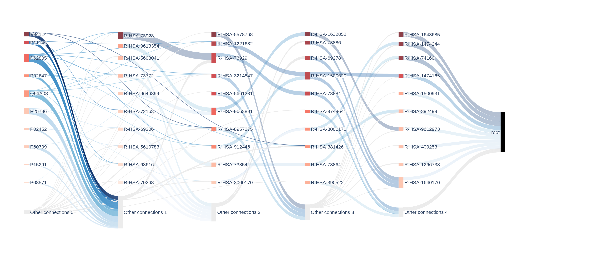

# Biologically Informed Neural Network (BINN)

[](https://github.com/InfectionMedicineProteomics/BINN/actions/workflows/pages/pages-build-deployment)
[](https://opensource.org/licenses/MIT)

BINN documentation is avaiable [here.](https://infectionmedicineproteomics.github.io/BINN/)

The BINN-package allows you to create a sparse neural network from a pathway and input file. The examples presented in [docs](<(https://infectionmedicineproteomics.github.io/BINN/)>) use the [Reactome pathway database](https://reactome.org/) and a proteomic dataset to generate the neural network. It also allows you to train and interpret the network using [SHAP](https://github.com/slundberg/shap). Plotting functions are also available for generating sankey plots. The article presenting the BINN can currently be found at [bioRxiv](https://doi.org/10.1101/2023.02.16.528807).

---

## Usage

First, a network is created. This is the network that will be used to create the sparse BINN.

```py
from binn import BINN, Network
import pandas as pd

input_data = pd.read_csv("../data/test_data.tsv", sep="\t")
translation = pd.read_csv("../data/translation.tsv", sep="\t")
pathways = pd.read_csv("../data/pathways.tsv", sep="\t")

network = Network(
    input_data=input_data,
    pathways=pathways,
    mapping=translation,
    verbose=True
)
```

The BINN can thereafter be generated using the network:

```py
binn = BINN(
    pathways=network,
    n_layers=4,
    dropout=0.2,
    validate=False,
)
```

An sklearn wrapper is also available:

```py
from binn import BINNClassifier

binn = BINNClassifier(
    pathways=network,
    n_layers=4,
    dropout=0.2,
    validate=True,
    epochs=10,
    threads=10,
)
```

This generates the Pytorch sequential model:

```py
Sequential(
  (Layer_0): Linear(in_features=446, out_features=953, bias=True)
  (BatchNorm_0): BatchNorm1d(953, eps=1e-05, momentum=0.1, affine=True, track_running_stats=True)
  (Dropout_0): Dropout(p=0.2, inplace=False)
  (Tanh 0): Tanh()
  (Layer_1): Linear(in_features=953, out_features=455, bias=True)
  (BatchNorm_1): BatchNorm1d(455, eps=1e-05, momentum=0.1, affine=True, track_running_stats=True)
  (Dropout_1): Dropout(p=0.2, inplace=False)
  (Tanh 1): Tanh()
  (Layer_2): Linear(in_features=455, out_features=162, bias=True)
  (BatchNorm_2): BatchNorm1d(162, eps=1e-05, momentum=0.1, affine=True, track_running_stats=True)
  (Dropout_2): Dropout(p=0.2, inplace=False)
  (Tanh 2): Tanh()
  (Layer_3): Linear(in_features=162, out_features=28, bias=True)
  (BatchNorm_3): BatchNorm1d(28, eps=1e-05, momentum=0.1, affine=True, track_running_stats=True)
  (Dropout_3): Dropout(p=0.2, inplace=False)
  (Tanh 3): Tanh()
  (Output layer): Linear(in_features=28, out_features=2, bias=True)
)
```

### Example input

Test data - this file should contain a column with the feature names (quantmatrix or some matrix containing input column - in this case "Protein")

| PeptideSequence                    | Protein (this is our input column) |
| ---------------------------------- | ---------------------------------- |
| VDRDVAPGTLC(UniMod:4)DVAGWGIVNHAGR | P00746                             |
| VDRDVAPGTLC(UniMod:4)DVAGWGIVNHAGR | P00746                             |
| VDTVDPPYPR                         | P04004                             |
| AVTEQGAELSNEER                     | P27348                             |
| VDVIPVNLPGEHGQR                    | P02751                             |

Pathways file - this file should contain the mapping used to create the connectivity in the hidden layers.

| parent (target) | child (source) |
| --------------- | -------------- |
| R-BTA-109581    | R-BTA-109606   |
| R-BTA-109581    | R-BTA-169911   |
| R-BTA-109581    | R-BTA-5357769  |
| R-BTA-109581    | R-BTA-75153    |
| R-BTA-109582    | R-BTA-140877   |

Translation file - this file is alternative, but is useful if some translation is needed to map the input features to the pathways in the hiddenn layers. In this case, it is used to map proteins (UniProt IDs) to pathways (Reactome IDs).

| input (UniProd IDs) | translation (Reactome IDs) |
| ------------------- | -------------------------- |
| A0A075B6P5          | R-HSA-166663               |
| A0A075B6P5          | R-HSA-173623               |
| A0A075B6P5          | R-HSA-198933               |
| A0A075B6P5          | R-HSA-202733               |
| A0A075B6P5          | R-HSA-2029481              |

---

### Plotting

Plotting a subgraph starting from a node generates the plot:

A compelte sankey may look like this:


## Installation

The package can be installed with git.

```
git clone git@github.com:InfectionMedicineProteomics/BINN.git
pip install -e BINN/
```

## Testing

The software has been tested on desktop machines running Windows 10/Linux (Ubuntu). Small networks are not RAM-intensive and all experiments have been run comfortably with 16 GB RAM.

## Contributors

[Erik Hartman](https://orcid.org/0000-0001-9997-2405), infection medicine proteomics, Lund University

[Aaron Scott](https://orcid.org/0000-0002-2391-6914), infection medicine proteomics, Lund University

## Contact

Erik Hartman - erik.hartman@hotmail.com


