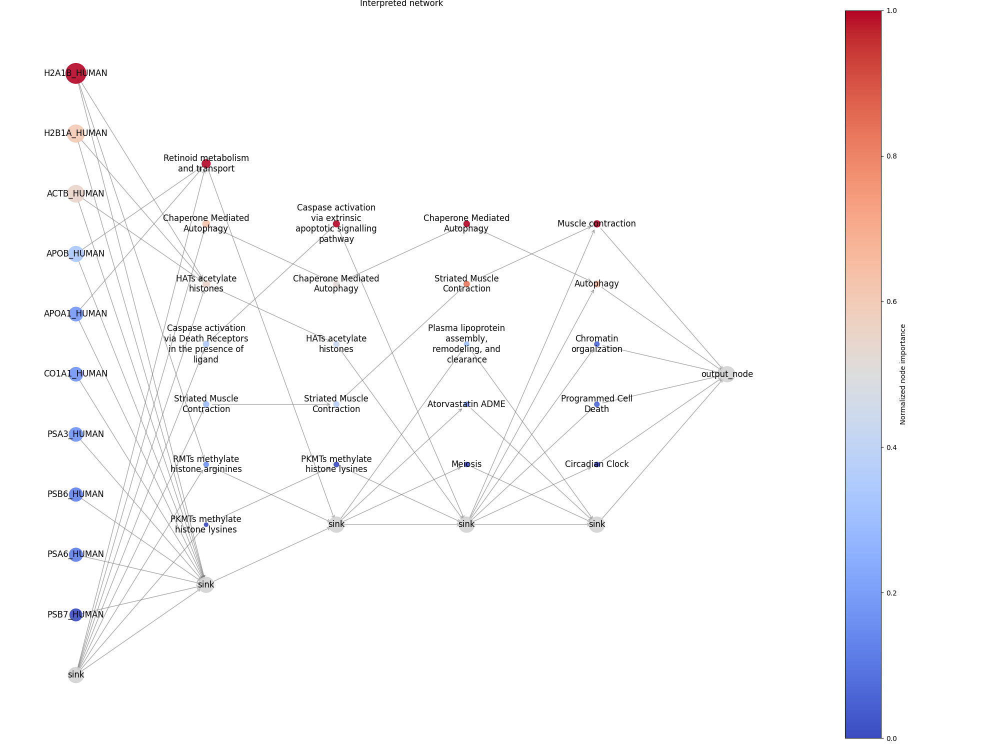

<p align="center">
    
<p>

# Biologically Informed Neural Network (BINN)

[](https://github.com/InfectionMedicineProteomics/BINN/actions/workflows/pages/pages-build-deployment)
[](https://opensource.org/licenses/MIT)
[](https://badge.fury.io/py/binn)
[](https://github.com/InfectionMedicineProteomics/BINN/actions/workflows/python-app.yml)
[](https://zenodo.org/badge/latestdoi/535627233)

BINN documentation is avaiable [here.](https://infectionmedicineproteomics.github.io/BINN/)

The BINN-package allows you to create a sparse neural network from a pathway and input file. The examples presented in [docs](<(https://infectionmedicineproteomics.github.io/BINN/)>) use the [Reactome pathway database](https://reactome.org/) and a proteomic dataset to generate the neural network. It also allows you to train and interpret the network using [SHAP](https://github.com/slundberg/shap). Plotting functions are also available for generating sankey plots. The article presenting the BINN can currently be found [here](https://doi.org/10.1038/s41467-023-41146-4).

Have a look at the ```poster_ndpia.ipynb``` for an example of a complete quick and easy BINN analysis.

---

## Installation

BINN can be installed via `pip`

```
pip install binn
```

The package can also be built from source and installed with git.

```
git clone git@github.com:InfectionMedicineProteomics/BINN.git
pip install -e BINN/
```

## Usage

The complete pipeline to create, train and interpret a BINN is:

```py
from binn import BINN, BINNDataLoader, BINNTrainer, BINNExplainer
import pandas as pd

# Load your data
data_matrix = pd.read_csv("../data/sample_datamatrix.csv")
design_matrix = pd.read_csv("../data/sample_design_matrix.tsv", sep="\t")

# Initialize BINN
binn = BINN(data_matrix=data_matrix, network_source="reactome", n_layers=4, dropout=0.2)

## Initialize DataLoader
binn_dataloader = BINNDataLoader(binn)

# Create DataLoaders
dataloaders = binn_dataloader.create_dataloaders(
    data_matrix=data_matrix,
    design_matrix=design_matrix,
    feature_column="Protein",
    group_column="group",
    sample_column="sample",
    batch_size=32,
    validation_split=0.2,
)
# Train the model
trainer = BINNTrainer(binn)
trainer.fit(dataloaders=dataloaders, num_epochs=100)

# Explain the model
explainer = BINNExplainer(binn)
single_explanations = explainer.explain_single(dataloaders, split="val", normalization_method="subgraph")
single_explanations
```

The output can be visualized in a network:

```py
from binn.plot.network import visualize_binn

layer_specific_top_n = {"0": 10, "1": 7, "2": 5, "3":5, "4":5}
plt = visualize_binn(single_explanations, top_n=layer_specific_top_n, plot_size=(20,10), sink_node_size=500, node_size_scaling = 200, edge_width=1,  node_cmap="coolwarm")
plt.title("Interpreted network")
```




## Cite 
Please cite: 

Hartman, E., Scott, A.M., Karlsson, C. et al. Interpreting biologically informed neural networks for enhanced proteomic biomarker discovery and pathway analysis. Nat Commun 14, 5359 (2023). https://doi.org/10.1038/s41467-023-41146-4

if you use this package.
## Contributors

[Erik Hartman](https://orcid.org/0000-0001-9997-2405), infection medicine proteomics, Lund University

[Aaron Scott](https://orcid.org/0000-0002-2391-6914), infection medicine proteomics, Lund University

## Contact

Erik Hartman - erik.hartman@hotmail.com
