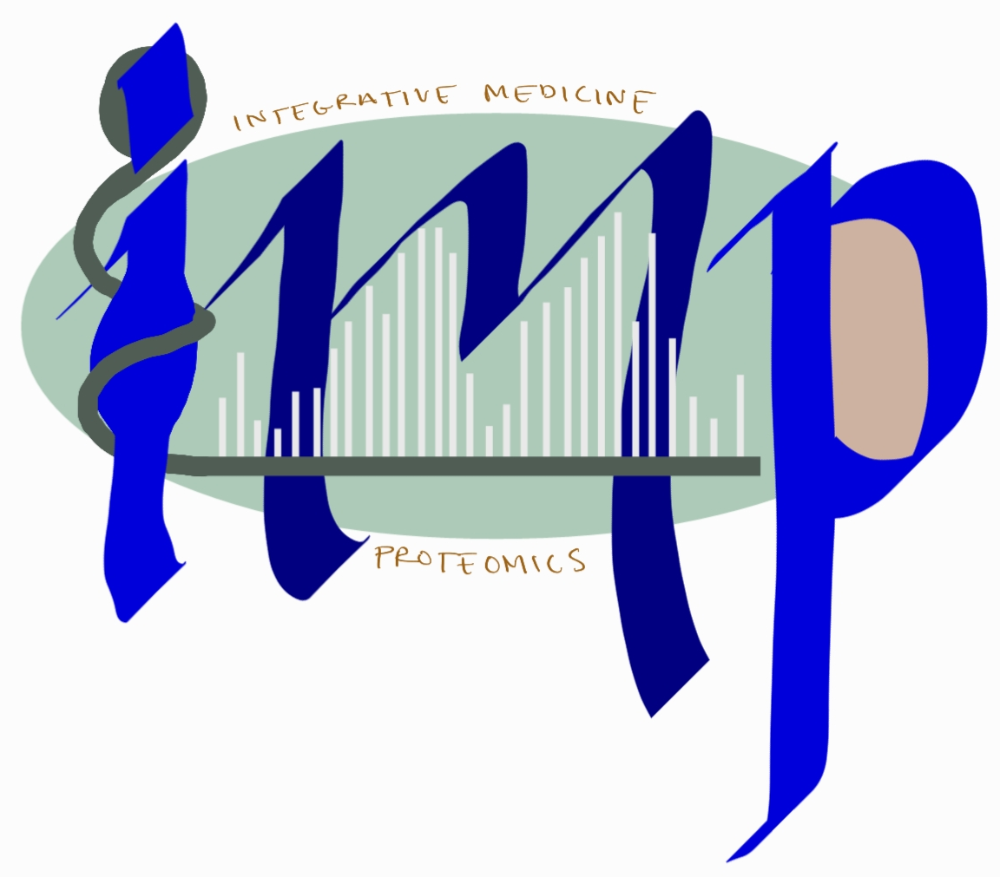

# Welcome to the BINN documentation

The BINN-package allows you to create a sparse neural network in the PyTorch-framework from a pathway and input file. It also allows you to train and interpret the network using [SHAP](https://arxiv.org/abs/1705.07874).

<a style="color:red">Note that the docs are still stabilizing!</a>

### Table Of Contents

- Introduction
- Install
- [API Reference](reference.md)

**Examples:**

In the [examples](binn_example.ipynb) we use proteins as the input layer and the Reactome pathway database to generate the BINN. The network is trained on mass-spec intensity values.

- [BINN example](binn_example.ipynb)
- [Interpretation example](shap_example.ipynb)

### Introduction

Biological systems are highly complex and require tools which are capable of capturing that complexity while at the same time making the systems understandable. Here, we have created a package which generates **BINNs (_Biologically Informed Neural Networks_)**. A BINN is generated using an underlying graph which determines the connecitivty between its layers and the annotations for each node. The implementation is agnostic to the input graph and can be provided with e.g., [Reactome pathways](https://reactome.org/), [KEGG pathways](https://www.genome.jp/kegg/), or [Gene Ontology pathways](http://geneontology.org/).

The initial layer of the BINN contain the input features, and should connect to the chosen graph. This could be genes, proteins or any other entities which map correctly to the input graph. The network is then trained and interpreted using SHAP. This results in importance values for each node in the network, allowing you to identify which biological entities and pathways are important for the classification you trained the network on.

We also include some plotting functionalities which allow you to visualize the importance of each node in the network.

|                                                                                                                                                                        |
| :--------------------------------------------------------------------------------------------------------------------------------------------------------------------------------------------------------------: |
| Sankey plot showing the importance of a of a BINN. The first layer of the BINN contains proteins (hence the UniProt ID in the first layer). The hidden layers are generated using the Reactome pathway database. |

We can also subset an importance-graph to generate visualizations for specific parts of the network, e.g., originating from a certain node and looking downstream. In the example below we subset the BINN by choosing node 'P02766' and looking at what nodes it influences downstream:

|                                    |
| :-------------------------------------------------------------------: |
| Sankey plot showing the importance of nodes downstream from 'P02766'. |

### Install

Currently, the package is available at GitHub and can be cloned with the following commands.

```
git clone git@github.com:InfectionMedicineProteomics/BINN.git
pip install -e BINN/
```

We are working on making the package available through pip.

### Contributors

[Erik Hartman](https://orcid.org/0000-0001-9997-2405), infection medicine proteomics, Lund University

[Aaron Scott](https://orcid.org/0000-0002-2391-6914), infection medicine proteomics, Lund University

### Contact

Erik Hartman - erik.hartman@hotmail.com

### GitHub repo

[github.com/InfectionMedicineProteomics/BINN](https://github.com/InfectionMedicineProteomics/BINN)

### Cite

The article presenting the BINN is currently avaiable on bioRXiv. Please cite:

"Interpreting biologically informed neural networks for enhanced biomarker discovery and pathway analysis", Erik Hartman, Aaron Scott, Lars Malmström, Johan Malmström, bioRxiv 2023.02.16.528807; doi: https://doi.org/10.1101/2023.02.16.528807

<br><br><br><br>

