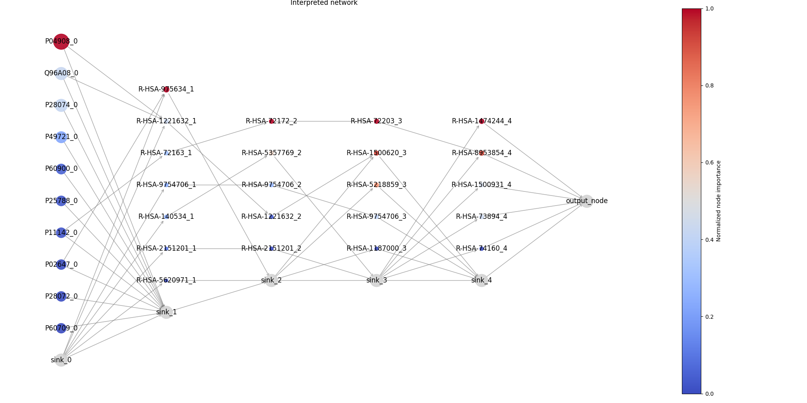

<p align="center">
    
</p>


# Welcome to the BINN documentation

The BINN-package allows you to create a sparse neural network in the PyTorch-framework from a pathway and input file. It also allows you to train and interpret the network using [SHAP](https://arxiv.org/abs/1705.07874). The package is hosted on [GitHub](https://github.com/InfectionMedicineProteomics/BINN).


# Table Of Contents

- [Install](#install)
- [Introduction](#introduction)
- [API Reference](reference/binn_ref.md)

# Install

BINN can be installed via `pip`

```
pip install binn
```

The package can also be built from source and installed with git.

```
git clone git@github.com:InfectionMedicineProteomics/BINN.git
pip install -e BINN/
```

**Examples:**

In the [examples](binn_example.ipynb) we use proteins as the input layer and the Reactome pathway database to generate the BINN. The network is trained on quantified proteins by mass spectrometry.

- [Creating and training a BINN](binn_example.ipynb)
- [Full example with interpretation and visualization](shap_example.ipynb)
- [Robustness analysis](robustness.ipynb)

# Introduction

Biological systems are highly complex and require tools which are capable of capturing that complexity while at the same time making the systems understandable. Here, we have created a package which generates **BINNs (_Biologically Informed Neural Networks_)**. A BINN is generated using an underlying graph which determines the connecitivty between its layers and the annotations for each node. The implementation is agnostic to the input graph and can be provided with e.g., [Reactome pathways](https://reactome.org/), [KEGG pathways](https://www.genome.jp/kegg/), [Gene Ontology pathways](http://geneontology.org/) or your own curated pathways.

The initial layer of the BINN contain the input features, and should connect to the chosen graph. This could be genes, proteins or any other entities which map correctly to the input graph. The network is then trained and interpreted using SHAP. This results in importance values for each node in the network, allowing you to identify which biological entities and pathways are important for the classification you trained the network on.

We also include some plotting functionalities which allow you to visualize the importance of each node in the network.

|                                                                                                                     |
| :--------------------------------------------------------------------------------------------------------------------------------------------------------------------------------------------------------------: |
| Network showing the importance of nodes in a BINN. The first layer of the BINN contains proteins (hence the UniProt ID in the first layer). The hidden layers are generated using the Reactome pathway database. |


# Contributors

[Erik Hartman](https://orcid.org/0000-0001-9997-2405), infection medicine proteomics, Lund University

[Aaron Scott](https://orcid.org/0000-0002-2391-6914), infection medicine proteomics, Lund University

# Contact

Erik Hartman - erik.hartman@hotmail.com

# GitHub repo

[github.com/InfectionMedicineProteomics/BINN](https://github.com/InfectionMedicineProteomics/BINN)

# Cite

Please cite: 

Hartman, E., Scott, A.M., Karlsson, C. et al. Interpreting biologically informed neural networks for enhanced proteomic biomarker discovery and pathway analysis. Nat Commun 14, 5359 (2023). https://doi.org/10.1038/s41467-023-41146-4

if you use this package.
